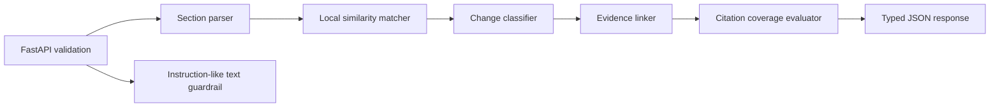

# ChangeLens

[](https://github.com/Talk2rakesh-1/policy-change-lens/actions/workflows/ci.yml)

ChangeLens is a local-first FastAPI service that compares two Markdown or plain-text document versions, identifies section-level changes, and returns source evidence plus a measurable citation-coverage score.

## Problem and target users

Policy, security, and engineering documents change frequently, but raw line diffs are noisy and AI summaries can omit evidence. ChangeLens is for governance teams, platform engineers, and reviewers who need a deterministic first pass with traceable source sections. It does not make legal or compliance decisions.

## Key features

- Section-aware added, removed, and modified findings
- Evidence attached to every finding and citation-coverage evaluation
- Local lexical retrieval endpoint for evidence discovery
- Untrusted-document guardrail that flags instruction-like content while treating it only as data
- Typed input limits, null-byte rejection, structured API errors, request IDs, and latency headers
- FastAPI/OpenAPI, Docker health check, non-root container, tests, linting, coverage, Gitleaks, and Dependabot
- No model download, API key, dataset, network call, or paid service

## Architecture



## Technology stack

Python 3.11+, FastAPI, Pydantic 2, Uvicorn, pytest, Ruff, Docker, GitHub Actions, Gitleaks, and Dependabot.

## Folder structure

```text
src/change_lens/api.py         HTTP endpoints and request telemetry
src/change_lens/documents.py   normalization, parsing, and similarity
src/change_lens/engine.py      comparison, retrieval, evidence, evaluation
src/change_lens/guardrails.py  untrusted-document warnings
src/change_lens/models.py      validated API contracts
tests/                         unit and API integration tests
```

## Setup

```bash
git clone https://github.com/Talk2rakesh-1/policy-change-lens.git
cd policy-change-lens
python3 -m venv .venv
source .venv/bin/activate
pip install -e '.[dev]'
uvicorn change_lens.api:app --reload
```

Open `http://127.0.0.1:8000/docs` for the generated API UI. No environment variables are required; `.env.example` documents the optional log level.

## Usage

```bash
curl -s http://127.0.0.1:8000/v1/compare \
  -H 'Content-Type: application/json' \
  -d '{
    "before":{"name":"v1.md","content":"# Access\nAdmins use passwords."},
    "after":{"name":"v2.md","content":"# Access\nAdmins use passkeys."}
  }'
```

The response contains typed findings, quotes from both versions, a unique request ID, warnings, and `citation_coverage`.

## Testing and quality

```bash
ruff check .
ruff format --check .
pytest --cov=change_lens --cov-report=term-missing
docker build -t policy-change-lens .
```

CI runs all four commands and scans Git history for secrets.

## Security, privacy, and responsible AI

- Documents remain within the running process; the service has no database or outbound calls.
- Inputs are length-limited and null bytes are rejected.
- Document text is never executed or promoted to instructions.
- Instruction-like phrases produce warnings rather than changing system behavior.
- Deterministic output is inspectable and reproducible; there is no hidden model inference.
- Similarity is lexical, not semantic truth. Human reviewers remain responsible for conclusions.
- Logs record method, path, status, and duration—not document contents.

## Resources and license compatibility

| Resource | URL | License/status |
|---|---|---|
| NIST AI RMF Playbook | https://airc.nist.gov/AI_RMF_Playbook | U.S. government guidance; referenced, not redistributed |
| FastAPI | https://github.com/fastapi/fastapi | MIT |
| Pydantic | https://github.com/pydantic/pydantic | MIT |
| Uvicorn | https://github.com/encode/uvicorn | BSD-3-Clause |
| pytest | https://github.com/pytest-dev/pytest | MIT |
| Ruff | https://github.com/astral-sh/ruff | MIT |

No external dataset, model, document corpus, or asset is bundled. MIT is compatible with the listed dependencies.

## Known limitations

- Markdown headings provide the strongest section boundaries; plain text becomes one section.
- Jaccard token similarity does not understand paraphrases or domain meaning.
- Cross-section moves can appear as removed and added findings.
- The service does not parse PDF/DOCX or persist comparison history.

## Future improvements

Add pluggable local embeddings, PDF/DOCX adapters, section-move detection, golden-set evaluation, OpenTelemetry export, and an optional human-approved local-LLM summarizer.

## Troubleshooting

- `422`: inspect the response detail for empty, oversized, or malformed fields.
- No search results: lexical retrieval requires at least one shared normalized token.
- Docker health check fails: confirm the service is listening on port 8000.
- Editable install fails: use Python 3.11 or newer and upgrade pip.
